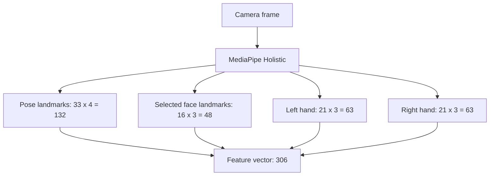
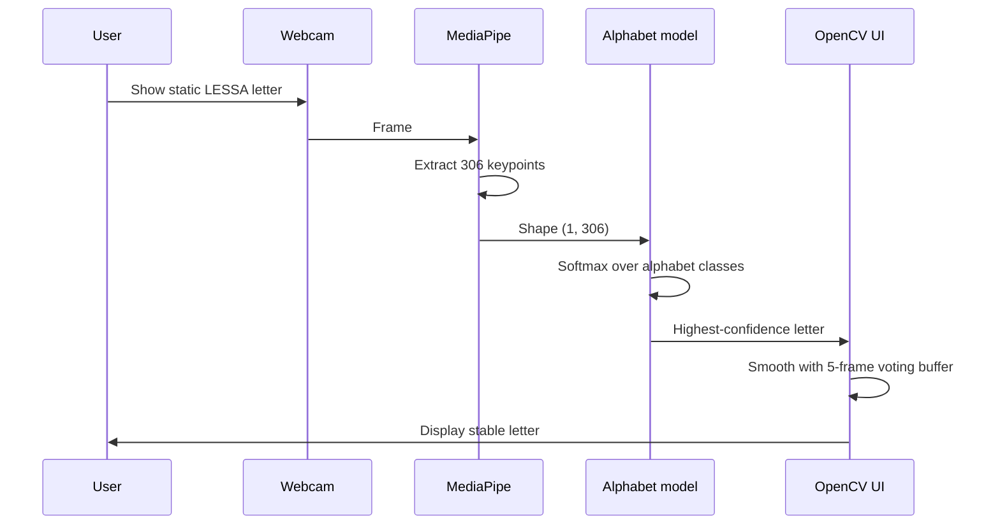

# Modelo Alfabeto LESSA

`modeloAlfabeto` is a standalone research pipeline for recognizing static LESSA alphabet signs from webcam images. It is separate from the word/phrase LSTM pipeline: this model classifies one still frame at a time using MediaPipe landmarks.

## What it recognizes

The alphabet classes are defined in `config_alfabeto.py`:

```python
ALPHABET = list("ABCDEFGHIKLMNOPQRSTUVWXY")
```

`J` and `Z` are intentionally absent because they usually require motion, while this model is static-frame based.

## Project structure

```text
modeloAlfabeto/
├── 1a_capturar_alfabeto.py      # Capture raw webcam images per letter
├── 1b_procesar_alfabeto_h5.py   # Convert images into MediaPipe keypoints
├── 2_entrenamiento_alfabeto.py  # Train the static classifier
├── 3_traduccion_alfabeto.py     # Run real-time alphabet prediction
├── config_alfabeto.py           # Shared labels, paths, and feature extraction
├── pyproject.toml               # uv project metadata and Python dependencies
└── Makefile                     # Common uv setup and execution commands
```

Generated folders are ignored by Git:

```text
dataset_alfabeto/      # Raw captured images
data_h5_alfabeto/      # H5 keypoint datasets
modelo_alfabeto/       # Trained model and generated metrics
.venv/                 # Local Python environment
```

## End-to-end workflow


## Feature extraction

Each image/frame is converted into a `306` value vector:



The coordinates are relative to the nose landmark. This makes the model less dependent on where the signer is positioned in the camera frame.

## Setup

Use Python `3.11` through `uv`. MediaPipe classic `mp.solutions` is expected by these scripts and works with `mediapipe==0.10.13`. The uv project pins `opencv-contrib-python` because MediaPipe depends on the contrib OpenCV wheel.

From this folder:

```bash
make setup
```

That runs `uv sync --python 3.11`, creates `.venv`, and installs the dependencies declared in `pyproject.toml`.

To enter an activated shell:

```bash
make shell
```

Or activate the uv-managed environment manually:

```bash
source .venv/bin/activate
```

Verify MediaPipe:

```bash
make check
```

Expected output includes:

```text
mediapipe: 0.10.13 solutions: True
```

> Note: a Makefile cannot activate a virtual environment in your already-open parent shell. `make shell` starts a new activated shell, while `source .venv/bin/activate` activates the uv-managed `.venv` in your current shell. You can also run scripts directly with `uv run python <script>.py`.

## Commands

### 1. Capture images

```bash
make capture
```

This runs:

```bash
uv run python 1a_capturar_alfabeto.py
```

Controls:

- Press `r` to start auto-capture for the current letter.
- Press `q` to quit.

The script currently controls the capture amount in its main block:

```python
META_IMAGENES = 6
TIEMPO_ESPERA = 1.0
```

To capture 100 images per letter, set:

```python
META_IMAGENES = 100
```

### 2. Process images into H5 keypoints

```bash
make process
```

This creates one H5 file per letter under `data_h5_alfabeto/`.

### 3. Train the model

```bash
make train
```

Outputs:

```text
modelo_alfabeto/modelo_letras.h5
modelo_alfabeto/metricas/training_history.png
modelo_alfabeto/metricas/confusion_matrix.png
modelo_alfabeto/metricas/classification_report.txt
```

### 4. Run real-time prediction

```bash
make translate
```

The translator loads `modelo_alfabeto/modelo_letras.h5`, reads webcam frames, predicts a letter, and stabilizes the display with a 5-frame voting buffer.

## Runtime prediction flow



## Important notes

- This model is for static signs only.
- Good lighting and a clear hand pose matter more than background complexity.
- Collecting only a few images per letter is useful for a smoke test, but not enough for a robust classifier.
- If a letter already has images, the capture script only captures the missing amount up to `META_IMAGENES`.
- Generated data and model outputs should stay out of Git unless there is an explicit reason to version a specific artifact.
