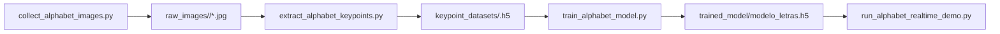

# LESSA Alphabet Research Pipeline

`research/alphabet` contains the static-letter workflow for collecting images, extracting MediaPipe keypoints, training the alphabet classifier, and smoke-testing it with an OpenCV demo. This pipeline is separate from the dynamic word/phrase model.

## Label contract

The alphabet classes are defined in `alphabet_config.py`:

```python
ALPHABET = list("ABCDEFGHIKLMNOPQRSTUVWXY")
```

`J` and `Z` are intentionally absent because they usually require motion, while this classifier uses one static frame at a time.

## File map

```text
research/alphabet/
├── alphabet_config.py               # Shared labels, paths, MediaPipe extraction, and feature constants
├── collect_alphabet_images.py       # Collect raw webcam images per letter
├── extract_alphabet_keypoints.py    # Convert images into H5 keypoint datasets
├── train_alphabet_model.py          # Train the static dense classifier
├── run_alphabet_realtime_demo.py    # OpenCV demo for local prediction checks
├── pyproject.toml                   # uv project metadata and Python dependencies
├── uv.lock                          # Locked dependency graph for reproducible uv installs
└── Makefile                         # Common setup and run commands
```

Generated folders are local outputs:

```text
raw_images/         # Raw captured images, grouped by letter
keypoint_datasets/  # H5 keypoint datasets, one file per letter
trained_model/      # Trained model and generated metrics
.venv/              # uv-managed Python environment
```

## End-to-end workflow



## Feature contract

Each image/frame is converted into a `306` value vector:

```text
pose:          33 landmarks x 4 values = 132
selected face: 16 landmarks x 3 values = 48
left hand:     21 landmarks x 3 values = 63
right hand:    21 landmarks x 3 values = 63
```

Coordinates are normalized relative to the nose landmark. This keeps the classifier less dependent on the signer's position in the camera frame.

## Setup

Use Python `3.11` through `uv`. MediaPipe classic `mp.solutions` is expected by these scripts and works with the pinned dependency set.

```bash
cd research/alphabet
make setup
make check
```

`make setup` runs `uv sync --python 3.11`. `make check` verifies Python, OpenCV, MediaPipe, and TensorFlow imports.

## Recommended execution order

```bash
cd research/alphabet
make capture
make process
make train
make translate
```

Equivalent direct commands:

```bash
uv run python collect_alphabet_images.py
uv run python extract_alphabet_keypoints.py
uv run python train_alphabet_model.py
uv run python run_alphabet_realtime_demo.py
```

### 1. Capture images

`collect_alphabet_images.py` captures the missing amount for each letter up to `TARGET_IMAGES`.

Controls:

- Press `r` to start auto-capture for the current letter.
- Press `space` to pause/resume while repositioning.
- Press `q` to quit.

### 2. Extract keypoints

`extract_alphabet_keypoints.py` reads `raw_images/<letter>/*.jpg`, discards frames without hand landmarks, and writes one H5 file per letter under `keypoint_datasets/`.

### 3. Train

`train_alphabet_model.py` trains a static dense classifier and writes:

```text
trained_model/modelo_letras.h5
trained_model/metrics/training_history.png
trained_model/metrics/confusion_matrix.png
trained_model/metrics/classification_report.txt
```

### 4. Smoke-test prediction

`run_alphabet_realtime_demo.py` loads `trained_model/modelo_letras.h5`, predicts letters from webcam frames, and stabilizes the display with a short voting buffer.

## Runtime handoff

After validating the classifier, copy the model artifact to the repository-root runtime folder:

```text
models/modelo_letras.h5
```

The FastAPI backend reports Alphabet mode unavailable until that artifact exists and loads successfully.

## Practical capture notes

- Use consistent lighting and keep the hand fully visible.
- Pause between letters to reposition the hand before continuing capture.
- Capture more than a smoke-test amount before relying on a model for a demo.
- Keep validation and test images untouched; only the training split should be augmented in future experiments.
