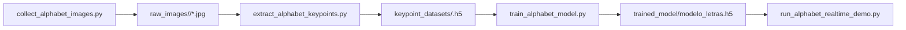

# Pipeline de investigación del alfabeto de LESSA

`research/alphabet` contiene el flujo de trabajo de letras estáticas para recolectar imágenes, extraer keypoints de MediaPipe, entrenar el clasificador del alfabeto y hacerle una prueba rápida (smoke-test) con un demo de OpenCV. Este pipeline es independiente del modelo dinámico de palabras/frases.

## Contrato de etiquetas

Las clases del alfabeto se definen en `alphabet_config.py`:

```python
ALPHABET = list("ABCDEFGHIKLMNOPQRSTUVWXY")
```

`J` y `Z` están ausentes intencionalmente porque normalmente requieren movimiento, mientras que este clasificador usa un fotograma estático a la vez.

## Mapa de archivos

```text
research/alphabet/
├── alphabet_config.py               # Shared labels, paths, MediaPipe extraction, and feature constants
├── collect_alphabet_images.py       # Collect raw webcam images per letter
├── extract_alphabet_keypoints.py    # Convert images into H5 keypoint datasets
├── train_alphabet_model.py          # Train the static dense classifier
├── run_alphabet_realtime_demo.py    # OpenCV demo for local prediction checks
├── pyproject.toml                   # uv project metadata and Python dependencies
├── uv.lock                          # Locked dependency graph for reproducible uv installs
└── Makefile                         # Common setup and run commands
```

Las carpetas generadas son salidas locales:

```text
raw_images/         # Raw captured images, grouped by letter
keypoint_datasets/  # H5 keypoint datasets, one file per letter
trained_model/      # Trained model and generated metrics
.venv/              # uv-managed Python environment
```

## Flujo de trabajo de extremo a extremo



## Contrato de características

Cada imagen/fotograma se convierte en un vector de `306` valores:

```text
pose:          33 landmarks x 4 values = 132
selected face: 16 landmarks x 3 values = 48
left hand:     21 landmarks x 3 values = 63
right hand:    21 landmarks x 3 values = 63
```

Las coordenadas se normalizan con respecto al punto de referencia (landmark) de la nariz. Esto hace que el clasificador dependa menos de la posición del señante dentro del fotograma de la cámara.

## Configuración

Use Python `3.11` a través de `uv`. Estos scripts esperan el MediaPipe clásico `mp.solutions`, que funciona con el conjunto de dependencias fijado.

```bash
cd research/alphabet
make setup
make check
```

`make setup` ejecuta `uv sync --python 3.11`. `make check` verifica las importaciones de Python, OpenCV, MediaPipe y TensorFlow.

## Orden de ejecución recomendado

```bash
cd research/alphabet
make capture
make process
make train
make translate
```

Comandos directos equivalentes:

```bash
uv run python collect_alphabet_images.py
uv run python extract_alphabet_keypoints.py
uv run python train_alphabet_model.py
uv run python run_alphabet_realtime_demo.py
```

### 1. Capturar imágenes

`collect_alphabet_images.py` captura la cantidad faltante para cada letra hasta `TARGET_IMAGES`.

Controles:

- Presione `r` para iniciar la autocaptura de la letra actual.
- Presione `space` para pausar/reanudar mientras se reposiciona.
- Presione `q` para salir.

### 2. Extraer keypoints

`extract_alphabet_keypoints.py` lee `raw_images/<letter>/*.jpg`, descarta los fotogramas sin landmarks de mano y escribe un archivo H5 por letra en `keypoint_datasets/`.

### 3. Entrenar

`train_alphabet_model.py` entrena un clasificador denso estático y escribe:

```text
trained_model/modelo_letras.h5
trained_model/metrics/training_history.png
trained_model/metrics/confusion_matrix.png
trained_model/metrics/classification_report.txt
```

### 4. Prueba rápida de predicción

`run_alphabet_realtime_demo.py` carga `trained_model/modelo_letras.h5`, predice letras a partir de fotogramas de la webcam y estabiliza la visualización con un búfer de votación corto.

## Entrega a ejecución

Después de validar el clasificador, copie el artefacto de modelo a la carpeta de ejecución en la raíz del repositorio:

```text
models/modelo_letras.h5
```

El backend de FastAPI reporta el modo Alfabeto como no disponible hasta que ese artefacto exista y se cargue correctamente.

## Notas prácticas de captura

- Use una iluminación consistente y mantenga la mano completamente visible.
- Haga pausas entre letras para reposicionar la mano antes de continuar la captura.
- Capture más que una cantidad de prueba rápida antes de depender de un modelo para una demo.
- Mantenga sin modificar las imágenes de validación y de prueba; solo el conjunto de entrenamiento debe aumentarse en experimentos futuros.
